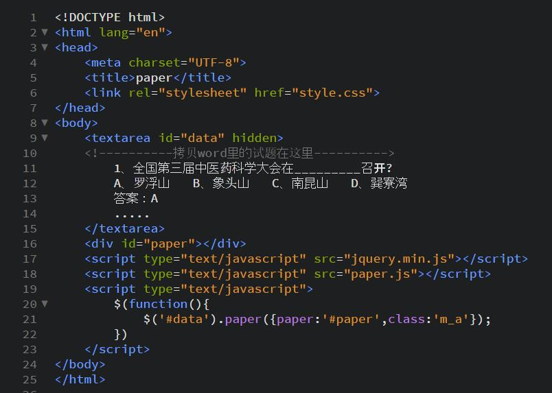

# paper
利用正则表达式把word文档里的大量调查卷试题快速地套进规定的html模块，以页面形式展现出来。
##正则表达式

* 去除多余的空格,注：不管是英文还是中文字符串之间的空格和换行符都被去除（慎用）

 ``replace(/\s+/g, "")``
* 匹配形如“ 数字+、 ”的字符串替换成‘ * ’字符

 ``replace(/[0-9]+、/g, "*")``

##分割

* 遇到*就分割
  
 ``split("*")``
* 遇到\n就分割
 
 ``split("\n")``
* 遇到 ‘ 答案： ’ 就分割
 
 ``split("答案：")``

##使用
* 首先在index.html引入jquery库
* 接着引入paper.js
* 编写index.html,如下：
 
* 源码

```html
<!DOCTYPE html>
<html lang="en">
<head>
    <meta charset="UTF-8">
    <title>paper</title>
    <link rel="stylesheet" href="style.css">
</head>
<body>
    <textarea id="data" hidden>
    1、全国第三届中医药科学大会在_________召开?
    A、罗浮山   B、象头山   C、南昆山   D、巽寮湾
    答案：A
    .....
    </textarea>
    <p class="des">博罗县罗浮山是惠州市首家国家5A级旅游景区，历史悠久，文化深厚，中草药植物丰富。现拥有植物3000多种，其中药用植物1200多种，是名副其实的百草药库。葛洪，东晋道教学者、著名的炼丹家、医学家，1700多年前在罗浮山修道炼丹、著书立说、悬壶济世，其著作的《肘后备急方》更是屠呦呦获得2015年诺贝尔医学奖和生理学奖的重要灵感来源。因此，围绕罗浮山丰富的中草药文化和葛洪及其妻子鲍姑的医学理念和成就编写了这套题，以普及大家中草药知识之用。 </p>
    <h2>罗浮山中医药文化科普知识100题</h2>
    <div id="paper"></div>
    <script type="text/javascript" src="http://code.jquery.com/jquery-1.6.4.min.js"></script>
    <script type="text/javascript" src="paper.js"></script>
    <script type="text/javascript">
        $(function(){
            $('#data').paper({paper:'#paper',class:'m_a'});
        })
    </script>
</body>
</html>


```
##效果
* html效果

 
 
* 页面效果

 

##DEMO
(http://htmlpreview.github.io/?https://github.com/xiazixing/paper/blob/master/index.html)
